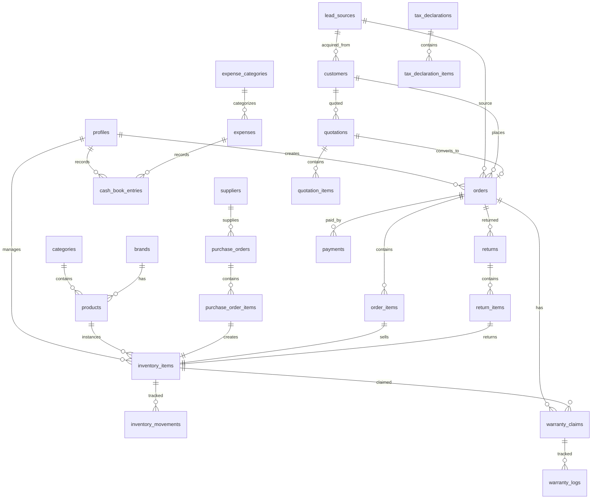

# 🏗️ ARCHITECTURE BLUEPRINT — ERP Quản Lý Kho & Bán Hàng

> **Dự án**: TechStore ERP  
> **Phiên bản**: v1.0 (Final Blueprint)  
> **Ngày tạo**: 2026-05-24  
> **Trạng thái**: ✅ Đã phê duyệt

---

## 1. Tech Stack — Gợi ý & Lý do

| Layer | Công nghệ | Lý do chọn |
|---|---|---|
| **Framework** | **Next.js 15** (App Router) | Full-stack, SSR/SSG, deploy Vercel miễn phí, cộng đồng lớn, dễ học |
| **Language** | **TypeScript** | Type-safe, giảm lỗi runtime, IntelliSense tốt, dễ maintain khi scale |
| **Database** | **Supabase** (PostgreSQL) | Đã có account, Auth/Storage/Realtime sẵn, Row Level Security, free tier đủ dùng |
| **ORM** | **Drizzle ORM** | Type-safe, lightweight, SQL-like syntax dễ hiểu, tích hợp tốt với Supabase |
| **UI Components** | **Shadcn/ui** + **Tailwind CSS v4** | Component chuyên nghiệp, accessible, customizable 100%, không bloat |
| **State Management** | **TanStack Query** (React Query) | Cache, sync, và fetch data tự động, đơn giản hơn Redux rất nhiều |
| **Forms** | **React Hook Form** + **Zod** | Validation mạnh mẽ, type-safe, performance tốt |
| **Charts** | **Recharts** | Đơn giản, đẹp, tích hợp tốt với React |
| **Auth** | **Supabase Auth** | Email/Password, OAuth, session management sẵn, RLS integration |
| **File Storage** | **Telegram Bot API** (ảnh) + **Supabase Storage** (PDF/docs) | Ảnh lưu qua Telegram Channel (miễn phí, vô hạn), PDF/chứng từ nhỏ lưu Supabase |
| **Hosting** | **Vercel** (giai đoạn đầu) → **AWS/VPS** (scale sau) | Free, auto-deploy từ Git, edge functions |
| **PDF Export** | **@react-pdf/renderer** | Xuất hóa đơn, phiếu bảo hành, báo cáo |
| **Notifications** | **Telegram Bot API** | Thông báo real-time mọi hoạt động qua Telegram, miễn phí, không cần app riêng |

> [!TIP]
> Stack này được chọn theo tiêu chí: **dễ học → dễ maintain → dễ scale**. Tất cả đều có tài liệu tiếng Việt/Anh phong phú.

---

## 2. Database Schema (Supabase / PostgreSQL)

### 2.1 Sơ đồ quan hệ tổng quan



---

### 2.2 Chi tiết từng bảng

#### 🔐 `profiles` — Quản lý người dùng & phân quyền

> Bảng này extend từ `auth.users` của Supabase

| Column | Type | Constraint | Mô tả |
|---|---|---|---|
| `id` | `UUID` | PK, FK → auth.users.id | ID người dùng (từ Supabase Auth) |
| `full_name` | `VARCHAR(100)` | NOT NULL | Họ tên |
| `phone` | `VARCHAR(20)` | UNIQUE | Số điện thoại |
| `email` | `VARCHAR(255)` | UNIQUE, NOT NULL | Email |
| `role` | `ENUM('owner', 'staff')` | NOT NULL, DEFAULT 'staff' | Vai trò |
| `avatar_url` | `TEXT` | NULLABLE | Ảnh đại diện |
| `is_active` | `BOOLEAN` | DEFAULT true | Trạng thái hoạt động |
| `created_at` | `TIMESTAMPTZ` | DEFAULT now() | Ngày tạo |
| `updated_at` | `TIMESTAMPTZ` | DEFAULT now() | Ngày cập nhật |

**Phân quyền (RBAC):**

| Chức năng | owner | staff |
|---|---|---|
| Xem Dashboard tổng | ✅ | ❌ |
| Quản lý kho (nhập/xuất) | ✅ | ✅ (chỉ xem) |
| Tạo/sửa đơn hàng | ✅ | ✅ |
| Xem lợi nhuận/biên lợi nhuận | ✅ | ❌ |
| Quản lý nhân viên | ✅ | ❌ |
| Kế toán / Sổ quỹ | ✅ | ❌ |
| Quản lý thuế | ✅ | ❌ |
| Quản lý bảo hành | ✅ | ✅ (chỉ xem) |

---

#### 📦 `categories` — Danh mục sản phẩm

| Column | Type | Constraint | Mô tả |
|---|---|---|---|
| `id` | `UUID` | PK, DEFAULT gen_random_uuid() | |
| `name` | `VARCHAR(100)` | NOT NULL, UNIQUE | Tên danh mục (Laptop, Phụ kiện, Màn hình...) |
| `slug` | `VARCHAR(100)` | NOT NULL, UNIQUE | URL-friendly name |
| `description` | `TEXT` | NULLABLE | Mô tả |
| `parent_id` | `UUID` | FK → categories.id, NULLABLE | Danh mục cha (cho sub-category) |
| `created_at` | `TIMESTAMPTZ` | DEFAULT now() | |

---

#### 🏭 `brands` — Thương hiệu

| Column | Type | Constraint | Mô tả |
|---|---|---|---|
| `id` | `UUID` | PK, DEFAULT gen_random_uuid() | |
| `name` | `VARCHAR(100)` | NOT NULL, UNIQUE | Tên thương hiệu (Apple, Dell, Lenovo...) |
| `logo_url` | `TEXT` | NULLABLE | Logo |
| `created_at` | `TIMESTAMPTZ` | DEFAULT now() | |

---

#### 💻 `products` — Sản phẩm (model chung)

> Đây là "model" sản phẩm, không phải từng chiếc máy cụ thể. VD: "MacBook Pro M3 14 inch"

| Column | Type | Constraint | Mô tả |
|---|---|---|---|
| `id` | `UUID` | PK, DEFAULT gen_random_uuid() | |
| `name` | `VARCHAR(255)` | NOT NULL | Tên sản phẩm |
| `slug` | `VARCHAR(255)` | NOT NULL, UNIQUE | URL-friendly |
| `sku` | `VARCHAR(50)` | UNIQUE | Mã sản phẩm nội bộ |
| `category_id` | `UUID` | FK → categories.id, NOT NULL | Danh mục |
| `brand_id` | `UUID` | FK → brands.id, NOT NULL | Thương hiệu |
| `description` | `TEXT` | NULLABLE | Mô tả chi tiết |
| `specs` | `JSONB` | NULLABLE | Cấu hình chi tiết (CPU, RAM, SSD, GPU, Màn hình...) |
| `warranty_months` | `INTEGER` | DEFAULT 12 | Thời gian bảo hành mặc định (tháng) |
| `images` | `TEXT[]` | NULLABLE | Mảng URL ảnh sản phẩm |
| `is_active` | `BOOLEAN` | DEFAULT true | Còn kinh doanh |
| `created_at` | `TIMESTAMPTZ` | DEFAULT now() | |
| `updated_at` | `TIMESTAMPTZ` | DEFAULT now() | |

---

#### 🏪 `suppliers` — Nhà cung cấp

| Column | Type | Constraint | Mô tả |
|---|---|---|---|
| `id` | `UUID` | PK, DEFAULT gen_random_uuid() | |
| `name` | `VARCHAR(200)` | NOT NULL | Tên nhà cung cấp |
| `contact_name` | `VARCHAR(100)` | NULLABLE | Người liên hệ |
| `phone` | `VARCHAR(20)` | NULLABLE | SĐT |
| `email` | `VARCHAR(255)` | NULLABLE | Email |
| `address` | `TEXT` | NULLABLE | Địa chỉ |
| `country` | `VARCHAR(50)` | DEFAULT 'VN' | Quốc gia (VN, US, CN...) |
| `tax_code` | `VARCHAR(20)` | NULLABLE | Mã số thuế |
| `notes` | `TEXT` | NULLABLE | Ghi chú |
| `is_active` | `BOOLEAN` | DEFAULT true | |
| `created_at` | `TIMESTAMPTZ` | DEFAULT now() | |

---

#### 📥 `purchase_orders` — Đơn nhập hàng

| Column | Type | Constraint | Mô tả |
|---|---|---|---|
| `id` | `UUID` | PK, DEFAULT gen_random_uuid() | |
| `po_number` | `VARCHAR(30)` | UNIQUE, NOT NULL | Mã đơn nhập (auto-gen: PO-20260523-001) |
| `supplier_id` | `UUID` | FK → suppliers.id, NOT NULL | Nhà cung cấp |
| `status` | `ENUM('in_transit', 'received', 'cancelled')` | DEFAULT 'in_transit' | Trạng thái |
| `origin_country` | `VARCHAR(50)` | DEFAULT 'VN' | Nguồn gốc hàng (US, VN...) |
| `shipping_method` | `VARCHAR(100)` | NULLABLE | Phương thức vận chuyển |
| `tracking_number` | `VARCHAR(100)` | NULLABLE | Mã tracking |
| `tracking_url` | `TEXT` | NULLABLE | Link tracking |
| `expected_arrival` | `DATE` | NULLABLE | Ngày dự kiến hàng về |
| `actual_arrival` | `DATE` | NULLABLE | Ngày hàng thực tế về |
| `shipping_cost` | `DECIMAL(15,2)` | DEFAULT 0 | Phí vận chuyển |
| `tax_import` | `DECIMAL(15,2)` | DEFAULT 0 | Thuế nhập khẩu |
| `total_cost` | `DECIMAL(15,2)` | NOT NULL | Tổng chi phí đơn nhập |
| `notes` | `TEXT` | NULLABLE | Ghi chú |
| `created_by` | `UUID` | FK → profiles.id | Người tạo |
| `created_at` | `TIMESTAMPTZ` | DEFAULT now() | |
| `updated_at` | `TIMESTAMPTZ` | DEFAULT now() | |

---

#### 📥📦 `purchase_order_items` — Chi tiết đơn nhập

| Column | Type | Constraint | Mô tả |
|---|---|---|---|
| `id` | `UUID` | PK, DEFAULT gen_random_uuid() | |
| `purchase_order_id` | `UUID` | FK → purchase_orders.id, NOT NULL | Đơn nhập |
| `product_id` | `UUID` | FK → products.id, NOT NULL | Sản phẩm (model) |
| `quantity` | `INTEGER` | NOT NULL, CHECK > 0 | Số lượng nhập |
| `unit_cost` | `DECIMAL(15,2)` | NOT NULL | Giá nhập / đơn vị |
| `total_cost` | `DECIMAL(15,2)` | GENERATED (quantity * unit_cost) | Tổng |
| `received_quantity` | `INTEGER` | DEFAULT 0 | Số lượng đã nhận |
| `notes` | `TEXT` | NULLABLE | |

---

#### 🖥️ `inventory_items` — Kho hàng (từng chiếc máy theo Serial)

| Column | Type | Constraint | Mô tả |
|---|---|---|---|
| `id` | `UUID` | PK, DEFAULT gen_random_uuid() | |
| `serial_number` | `VARCHAR(100)` | UNIQUE, NOT NULL | **Serial ID** — định danh duy nhất |
| `product_id` | `UUID` | FK → products.id, NOT NULL | Thuộc model nào |
| `purchase_order_item_id` | `UUID` | FK → purchase_order_items.id, NULLABLE | Nhập từ đơn nào |
| `condition` | `ENUM('new', 'used')` | NOT NULL | Tình trạng hàng: mới hoặc đã sử dụng |
| `status` | `ENUM('incoming', 'in_stock', 'reserved', 'sold', 'warranty_repair', 'returned', 'defective')` | DEFAULT 'incoming' | Trạng thái kho: đang về, sẵn hàng, đã bán, ... |
| `cost_price` | `DECIMAL(15,2)` | NOT NULL | Giá nhập (giá vốn) |
| `selling_price` | `DECIMAL(15,2)` | NULLABLE | Giá bán dự kiến |
| `specs_override` | `JSONB` | NULLABLE | Cấu hình riêng nếu khác model |
| `origin_country` | `VARCHAR(50)` | DEFAULT 'VN' | Nguồn gốc |
| `location` | `VARCHAR(100)` | NULLABLE | Vị trí trong kho |
| `expected_arrival_date` | `DATE` | NULLABLE | Ngày đợi hàng về |
| `received_date` | `DATE` | NULLABLE | Ngày thực tế nhận |
| `stocked_date` | `DATE` | NULLABLE | Ngày nhập kho |
| `sold_date` | `DATE` | NULLABLE | Ngày bán |
| `days_in_stock` | `INTEGER` | GENERATED (CURRENT_DATE - stocked_date) | Ngày tồn kho |
| `warranty_start` | `DATE` | NULLABLE | Ngày bắt đầu bảo hành |
| `warranty_end` | `DATE` | NULLABLE | Ngày hết bảo hành |
| `notes` | `TEXT` | NULLABLE | Ghi chú |
| `images` | `TEXT[]` | NULLABLE | Ảnh thực tế của máy |
| `created_by` | `UUID` | FK → profiles.id | Người tạo |
| `created_at` | `TIMESTAMPTZ` | DEFAULT now() | |
| `updated_at` | `TIMESTAMPTZ` | DEFAULT now() | |

---

#### 📣 `lead_sources` — Nguồn khách hàng

| Column | Type | Constraint | Mô tả |
|---|---|---|---|
| `id` | `UUID` | PK, DEFAULT gen_random_uuid() | |
| `name` | `VARCHAR(100)` | NOT NULL, UNIQUE | Tên nguồn (Facebook, Chợ Tốt, VOZ...) |
| `icon` | `VARCHAR(50)` | NULLABLE | Icon/emoji hiển thị |
| `color` | `VARCHAR(7)` | NULLABLE | Màu sắc hiển thị |
| `is_active` | `BOOLEAN` | DEFAULT true | Còn sử dụng |
| `created_at` | `TIMESTAMPTZ` | DEFAULT now() | |

---

#### 👤 `customers` — Khách hàng

| Column | Type | Constraint | Mô tả |
|---|---|---|---|
| `id` | `UUID` | PK, DEFAULT gen_random_uuid() | |
| `full_name` | `VARCHAR(100)` | NOT NULL | Họ tên |
| `phone` | `VARCHAR(20)` | NOT NULL | SĐT |
| `email` | `VARCHAR(255)` | NULLABLE | Email |
| `address` | `TEXT` | NULLABLE | Địa chỉ |
| `tax_code` | `VARCHAR(20)` | NULLABLE | MST |
| `customer_type` | `ENUM('individual', 'business')` | DEFAULT 'individual' | Cá nhân / Doanh nghiệp |
| `lead_source_id` | `UUID` | FK → lead_sources.id, NULLABLE | Nguồn khách |
| `notes` | `TEXT` | NULLABLE | |
| `total_spent` | `DECIMAL(15,2)` | DEFAULT 0 | Tổng tiền đã mua (cache) |
| `order_count` | `INTEGER` | DEFAULT 0 | Số đơn hàng (cache) |
| `created_at` | `TIMESTAMPTZ` | DEFAULT now() | |
| `updated_at` | `TIMESTAMPTZ` | DEFAULT now() | |

---

#### 🛒 `orders` — Đơn hàng bán

| Column | Type | Constraint | Mô tả |
|---|---|---|---|
| `id` | `UUID` | PK, DEFAULT gen_random_uuid() | |
| `order_number` | `VARCHAR(30)` | UNIQUE, NOT NULL | Mã đơn hàng (auto-gen) |
| `customer_id` | `UUID` | FK → customers.id, NOT NULL | Khách hàng |
| `lead_source_id` | `UUID` | FK → lead_sources.id, NULLABLE | Nguồn đơn hàng |
| `status` | `ENUM('completed', 'cancelled', 'refunded')` | DEFAULT 'completed' | Trạng thái |
| `sale_channel` | `ENUM('online', 'offline')` | NOT NULL | Kênh bán hàng |
| `subtotal` | `DECIMAL(15,2)` | NOT NULL | Tổng trước thuế/giảm giá |
| `discount_amount` | `DECIMAL(15,2)` | DEFAULT 0 | Giảm giá |
| `discount_percent` | `DECIMAL(5,2)` | DEFAULT 0 | % giảm giá |
| `tax_amount` | `DECIMAL(15,2)` | DEFAULT 0 | Thuế VAT |
| `total_amount` | `DECIMAL(15,2)` | NOT NULL | Tổng thanh toán |
| `total_cost` | `DECIMAL(15,2)` | NOT NULL | Tổng giá vốn |
| `profit` | `DECIMAL(15,2)` | GENERATED | Lợi nhuận |
| `profit_margin` | `DECIMAL(5,2)` | GENERATED | Biên lợi nhuận % |
| `payment_status` | `ENUM('unpaid', 'partial', 'paid', 'refunded')` | DEFAULT 'unpaid' | Trạng thái thanh toán |
| `payment_method` | `ENUM('cash', 'bank_transfer', 'card', 'mixed')` | NULLABLE | Phương thức thanh toán |
| `shipping_address` | `TEXT` | NULLABLE | Địa chỉ giao hàng |
| `notes` | `TEXT` | NULLABLE | |
| `sold_by` | `UUID` | FK → profiles.id, NOT NULL | Nhân viên bán |
| `created_at` | `TIMESTAMPTZ` | DEFAULT now() | |
| `updated_at` | `TIMESTAMPTZ` | DEFAULT now() | |

---

#### 📋 `quotations` — Báo giá

| Column | Type | Constraint | Mô tả |
|---|---|---|---|
| `id` | `UUID` | PK, DEFAULT gen_random_uuid() | |
| `quote_number` | `VARCHAR(30)` | UNIQUE, NOT NULL | Mã báo giá |
| `share_token` | `VARCHAR(64)` | UNIQUE, NOT NULL | Token duy nhất cho link public |
| `customer_id` | `UUID` | FK → customers.id, NULLABLE | Khách hàng |
| `customer_name` | `VARCHAR(100)` | NULLABLE | Tên KH (nếu chưa tạo customer) |
| `customer_phone` | `VARCHAR(20)` | NULLABLE | SĐT KH |
| `lead_source_id` | `UUID` | FK → lead_sources.id, NULLABLE | Nguồn KH |
| `status` | `ENUM('draft', 'sent', 'viewed', 'accepted', 'rejected', 'expired', 'converted')` | DEFAULT 'draft' | Trạng thái |
| `subtotal` | `DECIMAL(15,2)` | NOT NULL | Tổng giá |
| `discount_amount` | `DECIMAL(15,2)` | DEFAULT 0 | Giảm giá |
| `total_amount` | `DECIMAL(15,2)` | NOT NULL | Tổng sau giảm |
| `valid_until` | `DATE` | NULLABLE | Giá có hiệu lực đến ngày |
| `notes` | `TEXT` | NULLABLE | Ghi chú cho KH |
| `internal_notes` | `TEXT` | NULLABLE | Ghi chú nội bộ |
| `converted_order_id` | `UUID` | FK → orders.id, NULLABLE | Đã chuyển thành đơn hàng nào |
| `view_count` | `INTEGER` | DEFAULT 0 | Số lần KH xem link |
| `last_viewed_at` | `TIMESTAMPTZ` | NULLABLE | Lần cuối KH xem |
| `created_by` | `UUID` | FK → profiles.id | Nhân viên tạo |
| `created_at` | `TIMESTAMPTZ` | DEFAULT now() | |
| `updated_at` | `TIMESTAMPTZ` | DEFAULT now() | |

---

#### 📋📦 `quotation_items` — Chi tiết báo giá

| Column | Type | Constraint | Mô tả |
|---|---|---|---|
| `id` | `UUID` | PK, DEFAULT gen_random_uuid() | |
| `quotation_id` | `UUID` | FK → quotations.id, NOT NULL | Báo giá |
| `inventory_item_id` | `UUID` | FK → inventory_items.id, NULLABLE | Chiếc máy cụ thể |
| `product_id` | `UUID` | FK → products.id, NOT NULL | Sản phẩm |
| `quoted_price` | `DECIMAL(15,2)` | NOT NULL | Giá báo |
| `notes` | `TEXT` | NULLABLE | Ghi chú |

---

#### 🛒📦 `order_items` — Chi tiết đơn hàng

| Column | Type | Constraint | Mô tả |
|---|---|---|---|
| `id` | `UUID` | PK, DEFAULT gen_random_uuid() | |
| `order_id` | `UUID` | FK → orders.id, NOT NULL | Đơn hàng |
| `inventory_item_id` | `UUID` | FK → inventory_items.id, NOT NULL | Chiếc máy cụ thể (theo Serial) |
| `product_id` | `UUID` | FK → products.id, NOT NULL | Sản phẩm |
| `selling_price` | `DECIMAL(15,2)` | NOT NULL | Giá bán thực tế |
| `cost_price` | `DECIMAL(15,2)` | NOT NULL | Giá vốn (snapshot) |
| `discount` | `DECIMAL(15,2)` | DEFAULT 0 | Giảm giá trên item |
| `profit` | `DECIMAL(15,2)` | GENERATED | Lợi nhuận / item |
| `warranty_months` | `INTEGER` | NOT NULL | Số tháng bảo hành |

---

#### 💳 `payments` — Thanh toán

| Column | Type | Constraint | Mô tả |
|---|---|---|---|
| `id` | `UUID` | PK, DEFAULT gen_random_uuid() | |
| `order_id` | `UUID` | FK → orders.id, NOT NULL | Đơn hàng |
| `amount` | `DECIMAL(15,2)` | NOT NULL | Số tiền thanh toán |
| `payment_method` | `ENUM('cash', 'bank_transfer', 'card', 'momo', 'vnpay')` | NOT NULL | Phương thức |
| `payment_date` | `TIMESTAMPTZ` | DEFAULT now() | Ngày thanh toán |
| `reference_number` | `VARCHAR(100)` | NULLABLE | Mã giao dịch ngân hàng |
| `notes` | `TEXT` | NULLABLE | |
| `created_by` | `UUID` | FK → profiles.id | Người ghi nhận |
| `created_at` | `TIMESTAMPTZ` | DEFAULT now() | |

---

#### 🔄 `returns` — Đổi/Trả hàng

| Column | Type | Constraint | Mô tả |
|---|---|---|---|
| `id` | `UUID` | PK, DEFAULT gen_random_uuid() | |
| `return_number` | `VARCHAR(30)` | UNIQUE, NOT NULL | Mã phiếu đổi/trả |
| `order_id` | `UUID` | FK → orders.id, NOT NULL | Đơn hàng gốc |
| `customer_id` | `UUID` | FK → customers.id, NOT NULL | Khách hàng |
| `type` | `ENUM('return', 'exchange')` | NOT NULL | Trả hay đổi |
| `reason` | `ENUM('defective', 'wrong_item', 'changed_mind', 'upgrade', 'downgrade', 'other')` | NOT NULL | Lý do |
| `reason_detail` | `TEXT` | NOT NULL | Mô tả chi tiết |
| `status` | `ENUM('pending', 'approved', 'processing', 'completed', 'rejected')` | DEFAULT 'pending' | Trạng thái |
| `has_fee` | `BOOLEAN` | DEFAULT false | Có mất phí đổi/trả? |
| `fee_amount` | `DECIMAL(15,2)` | DEFAULT 0 | Phí đổi/trả |
| `refund_amount` | `DECIMAL(15,2)` | DEFAULT 0 | Số tiền hoàn |
| `exchange_difference` | `DECIMAL(15,2)` | DEFAULT 0 | Chênh lệch giá |
| `new_order_id` | `UUID` | FK → orders.id, NULLABLE | Đơn hàng mới |
| `notes` | `TEXT` | NULLABLE | |
| `processed_by` | `UUID` | FK → profiles.id, NOT NULL | Nhân viên xử lý |
| `created_at` | `TIMESTAMPTZ` | DEFAULT now() | |
| `updated_at` | `TIMESTAMPTZ` | DEFAULT now() | |

---

#### 🔄📦 `return_items` — Chi tiết sản phẩm đổi/trả

| Column | Type | Constraint | Mô tả |
|---|---|---|---|
| `id` | `UUID` | PK, DEFAULT gen_random_uuid() | |
| `return_id` | `UUID` | FK → returns.id, NOT NULL | Phiếu đổi/trả |
| `inventory_item_id` | `UUID` | FK → inventory_items.id, NOT NULL | Máy bị trả (Serial) |
| `product_id` | `UUID` | FK → products.id, NOT NULL | Sản phẩm |
| `return_reason` | `ENUM('defective', 'cosmetic', 'wrong_specs', 'customer_request', 'other')` | NOT NULL | Lý do trả |
| `condition_on_return` | `ENUM('like_new', 'good', 'damaged', 'defective')` | NOT NULL | Tình trạng khi nhận lại |
| `is_defective` | `BOOLEAN` | DEFAULT false | **Máy bị lỗi?** |
| `defect_description` | `TEXT` | NULLABLE | Mô tả lỗi |
| `original_price` | `DECIMAL(15,2)` | NOT NULL | Giá đã bán |
| `refund_price` | `DECIMAL(15,2)` | NOT NULL | Số tiền hoàn |
| `new_inventory_item_id` | `UUID` | FK → inventory_items.id, NULLABLE | Máy thay thế |
| `notes` | `TEXT` | NULLABLE | |

---

#### 🔧 `warranty_claims` — Yêu cầu bảo hành

| Column | Type | Constraint | Mô tả |
|---|---|---|---|
| `id` | `UUID` | PK, DEFAULT gen_random_uuid() | |
| `claim_number` | `VARCHAR(30)` | UNIQUE, NOT NULL | Mã bảo hành |
| `order_id` | `UUID` | FK → orders.id, NOT NULL | Đơn hàng |
| `order_item_id` | `UUID` | FK → order_items.id, NOT NULL | Sản phẩm trong đơn |
| `inventory_item_id` | `UUID` | FK → inventory_items.id, NOT NULL | Serial cụ thể |
| `customer_id` | `UUID` | FK → customers.id, NOT NULL | Khách hàng |
| `status` | `ENUM('pending', 'inspecting', 'repairing', 'waiting_parts', 'completed', 'rejected', 'replaced')` | DEFAULT 'pending' | Trạng thái |
| `issue_description` | `TEXT` | NOT NULL | Mô tả lỗi |
| `diagnosis` | `TEXT` | NULLABLE | Kết quả chẩn đoán |
| `resolution` | `TEXT` | NULLABLE | Giải pháp xử lý |
| `repair_cost` | `DECIMAL(15,2)` | DEFAULT 0 | Chi phí sửa |
| `is_under_warranty` | `BOOLEAN` | NOT NULL | Còn bảo hành? |
| `warranty_end_date` | `DATE` | NOT NULL | Ngày hết hạn |
| `received_date` | `DATE` | NOT NULL | Ngày nhận máy |
| `expected_return_date` | `DATE` | NULLABLE | Dự kiến trả |
| `actual_return_date` | `DATE` | NULLABLE | Trả thực tế |
| `created_by` | `UUID` | FK → profiles.id | Người tiếp nhận |
| `created_at` | `TIMESTAMPTZ` | DEFAULT now() | |
| `updated_at` | `TIMESTAMPTZ` | DEFAULT now() | |

---

#### 🔧📝 `warranty_logs` — Nhật ký bảo hành

| Column | Type | Constraint | Mô tả |
|---|---|---|---|
| `id` | `UUID` | PK, DEFAULT gen_random_uuid() | |
| `warranty_claim_id` | `UUID` | FK → warranty_claims.id, NOT NULL | Yêu cầu BH |
| `action` | `VARCHAR(100)` | NOT NULL | Hành động |
| `description` | `TEXT` | NOT NULL | Chi tiết |
| `old_status` | `VARCHAR(30)` | NULLABLE | Trạng thái cũ |
| `new_status` | `VARCHAR(30)` | NULLABLE | Trạng thái mới |
| `attachments` | `TEXT[]` | NULLABLE | Ảnh/tài liệu |
| `created_by` | `UUID` | FK → profiles.id | Người thực hiện |
| `created_at` | `TIMESTAMPTZ` | DEFAULT now() | |

---

#### 📂 Bảng Kế Toán (Thu Chi, Sổ Quỹ) & Nhật ký (Log)
Các bảng liên quan đến Kế toán (`expense_categories`, `expenses`, `cash_book_entries`, `tax_declarations`), hệ thống lưu vết kho (`inventory_movements`) và hệ thống thông báo (`telegram_settings`, `telegram_notification_events`, `telegram_notification_logs`) được thiết kế với chuẩn đầy đủ các trường id, trạng thái, người tạo, ngày tạo nhằm phục vụ tracking chặt chẽ.

---

### 2.3 Database Indexes & RLS Policies

```sql
-- Indexes cho hiệu suất
CREATE INDEX idx_inventory_serial ON inventory_items(serial_number);
CREATE INDEX idx_orders_customer ON orders(customer_id);
CREATE INDEX idx_warranty_inventory ON warranty_claims(inventory_item_id);

-- RLS Policies (Mẫu)
ALTER TABLE orders ENABLE ROW LEVEL SECURITY;

CREATE POLICY "Owner full access" ON orders FOR ALL USING (
  EXISTS (SELECT 1 FROM profiles WHERE id = auth.uid() AND role = 'owner')
);
```

---

## 3. Kiến trúc thư mục (Folder Structure) - Hoàn chỉnh

```text
techstore-erp/
├── .env.local                    # Biến môi trường
├── next.config.ts                # Next.js config
├── tailwind.config.ts            # Tailwind config
├── tsconfig.json                 # TypeScript config
├── drizzle.config.ts             # Drizzle ORM config
├── package.json
│
├── public/                       # Static assets
│
├── src/
│   ├── app/                      # Next.js App Router
│   │   ├── (auth)/               # Layout & Pages đăng nhập
│   │   ├── (dashboard)/          # Các module chính (Inventory, Orders, Warranty...)
│   │   └── api/                  # API Routes (Telegram webhook, Auth callback...)
│   │
│   ├── components/               # Components dùng chung
│   │   ├── ui/                   # Shadcn UI (buttons, tables, dialogs...)
│   │   ├── layout/               # Sidebar, Header, Breadcrumb
│   │   ├── inventory/            # Component chuyên dụng cho Kho
│   │   ├── orders/               # Component chuyên dụng cho Đơn hàng
│   │   └── shared/               # PageHeader, SearchBar, StatusBadge...
│   │
│   ├── lib/                      # Core utilities & configs
│   │   ├── supabase/             # Supabase clients (browser, server, middleware)
│   │   │   ├── client.ts
│   │   │   ├── server.ts
│   │   │   └── middleware.ts
│   │   │
│   │   ├── db/                   # Drizzle ORM
│   │   │   ├── index.ts          # Kết nối DB
│   │   │   └── schema/           # Nơi định nghĩa các bảng
│   │   │       ├── users.ts
│   │   │       ├── inventory.ts
│   │   │       ├── orders.ts
│   │   │       └── ...
│   │   │
│   │   ├── utils/                # Hàm tiện ích
│   │   │   ├── format.ts         # Tiền tệ (VND), Ngày tháng
│   │   │   ├── calculate.ts      # Tính lợi nhuận, thuế
│   │   │   └── export.ts         # Xuất PDF/Excel
│   │   │
│   │   └── telegram/             # Tích hợp Telegram Bot
│   │       └── bot.ts
│   │
│   ├── hooks/                    # Custom Hooks
│   │   ├── use-auth.ts
│   │   ├── use-inventory.ts
│   │   └── use-permissions.ts
│   │
│   └── types/                    # TypeScript Types & Interfaces
│       ├── database.types.ts     # Generate từ Supabase
│       └── index.ts              # Các type dùng chung
```

---

## 4. Lộ trình triển khai (Next Steps)

### Giai đoạn 1: Foundation (Tuần 1)
- [x] Khởi tạo Next.js, Tailwind v4 (và các component Apple-style tùy chỉnh).
- [x] Thiết lập cấu trúc thư mục.
- [x] Kết nối Supabase & setup Drizzle ORM schema.
- [x] Triển khai Supabase Auth (Login/Logout) + Middleware bảo vệ route (Proxy).
- [x] Xây dựng Layout Dashboard (Sidebar + Header).

### Giai đoạn 2: Core Modules (Tuần 2-3)
- [x] **Quản lý danh mục & Sản phẩm (CRUD):** Tạo form thêm, sửa, xóa sản phẩm (Model), Danh mục & Thương hiệu bằng Dialog cao cấp.
- [x] **Quản lý Kho hàng (Inventory):** Nhập kho theo serial, Thẻ kho (stock movements timeline) hiển thị chi tiết mượt mà.
- [x] **Quản lý Đơn hàng (Orders):** Quy trình bán hàng, trừ kho, tính lợi nhuận.

### Giai đoạn 3: Advanced Features (Tuần 4)
- [x] Báo giá 1 click (Quotations) dạng public link.
- [x] Đổi trả & Bảo hành (Warranty Claims) theo serial.
- [x] Tích hợp Telegram Bot thông báo real-time.

### Giai đoạn 4: Accounting & Polish (Tuần 5)
- [x] Kế toán (Thu Chi / Sổ quỹ).
- [x] Dashboard thống kê (Recharts).
- [x] Phân quyền chặt chẽ (RBAC) trên UI và DB (RLS).

